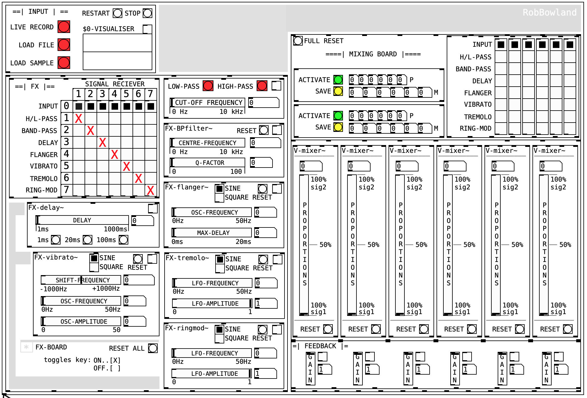

# Real-Time Voice Changer

This assignment involved the creation of a real-time voice changing application using the `PureData (Pd)` programming language. A full GUI was created, incorporating several signal processing techniques to produce various effects that can be applied to an audio signal.

The produced GUI (pictured above), provides functionality for dynamic effect synthesis, mixing and feedback application, leading to the possibility for a wide number of effects. Mixing presets can also be saved in the interface for re-application at a later time.

## Usage

### Pre-requisites

This project was developed using `pd-vanilla` version `Pd-0.51-1`, (later versions should work) and the following `externals` each loaded on startup:

- `zexy`  [version `2.3.1` was used for developing]
- `else`  [version `1.0-0 beta-33` was used for developing]
- `easyflow`

### GUI

The application comes complete with full documentation within `PureData`, to get started open `VoiceChanger.pd` and follow the provided links. Additional documentation can be found for each components created.

## Mark Breakdown

### Report

| Section        | Mark        | Comments                                                     |
| -------------- | ----------- | ------------------------------------------------------------ |
| *Whole Report* | ***39/50*** | **Q1** - The screenshot doesn't fully represent a voiced sound, as there is  no visible periodicity in the waveform. Vocal folds vibrate due to the  air, they don't vibrate on their own. **Q4** - FFT stands for Fast Fourier Transform and performs the Fourier analysis on time series to compute spectrum. **Q5** - Amplitude between -0.5 and 0.5. **Q7** - Amplitude modulation produces an output signal the bandwidth of  which is twice the maximum frequency of the original baseband signal. **Q8** - Also, because voice range is between 100 Hz and 4-8 kHz.* |

***Overall:    39/50   |   78%***

### Voice-Changer GUI

| Section             | Mark        | Comments                                                     |
| ------------------- | ----------- | ------------------------------------------------------------ |
| *GUI Functionality* | ***23/25*** | *Really great job, a selection of preset effects would have made it perfect* |
| *GUI Design*        | **15/15**   | -                                                            |
| *GUI Features*      | **5/5**     | *Really appreciate the helpful comments, good job*           |
| *GUI Innovations*   | **5/5**     | *The mixing board and method for selecting effects is really well thought out, great job* |

***Overall:    48/50   |   96%***

### Total & Comparison

|                 | Grade           |
| --------------- | --------------- |
| ***Me***        | ***87.00%***       |
| *Class Average* | ***57.21%*** |
| *Class Median*  | ***63.00%***    |
